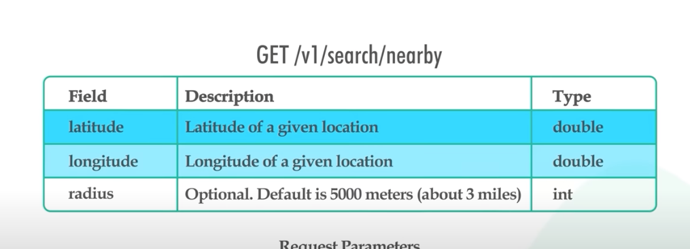

https://www.youtube.com/watch?v=M4lR_Va97cQ&list=PLCRMIe5FDPseVvwzRiCQBmNOVUIZSSkP8

Functional Feature
1. Given a users' location, and search in a given radius
2. Business owner can update their info, but not in a real time manner
3. Users can see business' info

Assumption: 
1. 100M DAU, 5 query/user, 5k QPS, peak could be doubled
2. 200M different businesses

Non Functional Feature
1. Latency should be low
2. Highly available during the peak hours

High level design
1. API design

2. Data schema

3. High level design diagram